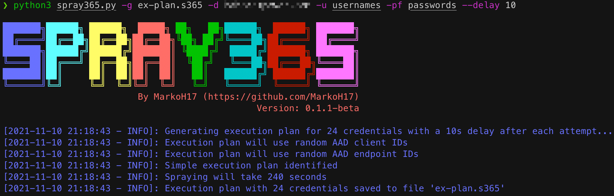
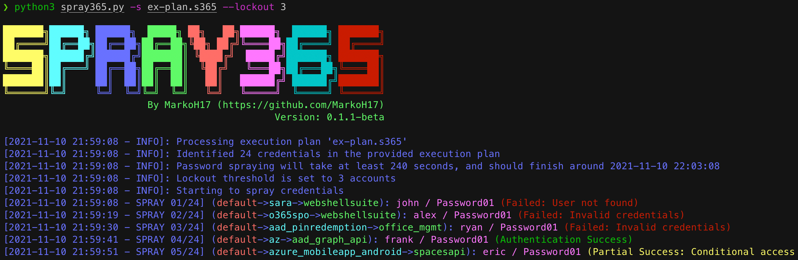

# What is Spray365?
Spray365 is a password spraying tool that identifies valid credentials for Microsoft accounts (Office 365 / Azure AD). How is Spray365 different from the many other password spraying tools that are already available? Spray365 enables passwords to be sprayed from an "execution plan". While having a pre-generated execution plan that describe the spraying operation well before it occurs has many other benefits that Spray365 leverages, this also allows password sprays to be resumed (`-R` option) after a network error or other interruption. While it is easiest to generate a Spray365 execution plan using Spray365 directly, other tools that produce a compatible JSON structure make it easy to build unique password spraying workflows. 

Spray365 exposes a few options that are useful when spraying credentials. Random user agents can be used to detect and bypass insecure conditional access policies that are configured to limit the types of allowed devices. Similarly, the `--shuffle_auth_order` argument is a great way to spray credentials in a less-predictable manner. This option was added in an attempt to bypass intelligent account lockouts (e.g. Azure Smart Lockout). While its not perfect, randomizing the order in which credentials are attempted have other benefits too, like making the detection of these spraying operations even more difficult. Spray365 also supports proxying traffic over HTTP/HTTPS, which integrates well with other tools like Burp Suite for manipulating the source of the spraying operation.

### Generating an Execution Plan (Step 1)


### Spraying Credentials with an Execution Plan (Step 2)


## Getting Started

### Installation
Clone the repository, install the required Python packages, and run Spray365!
```bash
$ git clone https://github.com/MarkoH17/Spray365
$ cd Spray365
~/Spray365$ pip3 install -r requirements.txt
~/Spray365$ python3 spray365.py
```

### Usage
#### Generate an Execution Plan
An execution plan is needed to spray credentials, so we need to create one! Spray365 can generate its own execution plan by running it in "generate" (`-g`) mode.
```bash
$ python3 spray365.py -g <path_for_saved_execution_plan> -d <domain_name> -u <file_containing_usernames> -pf <file_containing_passwords>
```
e.g.
```bash
$ python3 spray365.py -g ex-plan.s365 -d example.com -u usernames -pf passwords
```

#### Spraying an Execution Plan
Once an execution plan is available, Spray365 can be used to process it. Running Spray365 in "spray" (`-s`) mode will process the specified execution plan and spray the appropriate credentials.
```bash
$ python3 spray365.py -s <path_to_execution_plan>
```
e.g.
```bash
$ python3 spray365.py -s ex-plan.s365
```

### Other Options for Advanced Usage
#### Generate Mode Options

`--delay <int>`: Delay in seconds to wait between authentication attempts (default: 30)

`-cID / --aad_client <string>`: Client ID to use during authentication workflow (None for random selection, specify multiple in a comma-separated string) (default: None)

`-eID / --aad_endpoint <string>`: Endpoint ID to use during authentication workflow (None for random selection, specify multiple in a comma-separated string) (default: None)

`-S / --shuffle_auth_order`: Shuffle order of authentication attempts so that each iteration (User1:Pass1, User2:Pass1, User3:Pass1) will be sprayed in a random order, and with a random arrangement of passwords, e.g (User4:Pass16, User13:Pass25, User19:Pass40). Be aware this option introduces the possibility that the time between consecutive authentication attempts for a given user may occur as quickly as `DELAY` seconds apart. Consider using the -mD/--min_cred_loop_delay option to enforce a minimum delay between authentication attempts for any given user. (default: False)

`-SO / --shuffle_optimization_attempts <int>`: Number of random execution plans to generate for identifying the fastest execution plan (default: 10)

`-mD / --min_cred_loop_delay <int>`: Minimum time to wait between authentication attempts for a given user. This option takes into account the time one spray iteration will take, so a pre-authentication delay may not occur every time (disable with 0) (default: 0)

`-cUA / --custom_user_agent <int>`: Set custom user agent for authentication requests (default: None)

`-rUA, --random_user_agent <int>`: Randomize user agent for authentication requests (default: False)
  
#### Spray Mode Options
  
`--lockout <int>`: Number of account lockouts to observe before aborting spraying session (disable with 0) (default: 5)

`--proxy <string>`: HTTP Proxy URL (format: http[s]://proxy.address:port) (default: None)

`-R / --resume_index <int>`: Resume spraying passwords from this position in the execution plan (default: 0)

