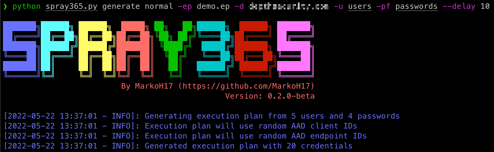
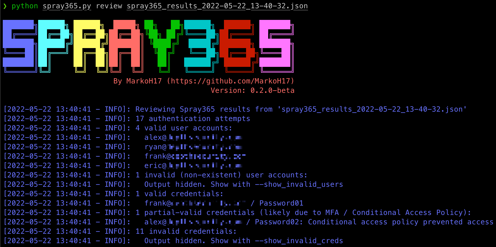

<p align="center">
  <a href="https://github.com/MarkoH17/Spray365/releases/latest">
    
  </a>
  <a href="https://github.com/MarkoH17/Spray365/stargazers">
    
  </a>
  <a href="https://github.com/MarkoH17/Spray365/network/members">
    
  </a>
  <a href="https://github.com/MarkoH17/Spray365/blob/main/LICENSE">
    
  </a>
  <a href="https://github.com/MarkoH17/Spray365/blob/main/spray365.py">
    
  </a>
  <br>
</p>

# What is Spray365?
Spray365 is a password spraying tool that identifies valid credentials for Microsoft accounts (Office 365 / Azure AD). How is Spray365 different from the many other password spraying tools that are already available? Spray365 enables passwords to be sprayed from an "execution plan". While having a pre-generated execution plan that describe the spraying operation well before it occurs has many other benefits that Spray365 leverages, this also allows password sprays to be resumed (`-R` option) after a network error or other interruption. While it is easiest to generate a Spray365 execution plan using Spray365 directly, other tools that produce a compatible JSON structure make it easy to build unique password spraying workflows. 

Spray365 exposes a few options that are useful when spraying credentials. Random user agents can be used to detect and bypass insecure conditional access policies that are configured to limit the types of allowed devices. Similarly, the `--shuffle_auth_order` argument is a great way to spray credentials in a less-predictable manner. This option was added in an attempt to bypass intelligent account lockouts (e.g., Azure Smart Lockout). While it’s not perfect, randomizing the order in which credentials are attempted have other benefits too, like making the detection of these spraying operations even more difficult. Spray365 also supports proxying traffic over HTTP/HTTPS, which integrates well with other tools like Burp Suite for manipulating the source of the spraying operation.

### Generating an Execution Plan (Step 1)


### Spraying Credentials with an Execution Plan (Step 2)


### Review Spray365 Results (Step 3)


## Getting Started

### Requirements
 - Python
   - 3.9 (minimum)
   - 3.10 (recommended)

### Installation
Clone the repository, install the required Python packages, and run Spray365!
```bash
$ git clone https://github.com/MarkoH17/Spray365
$ cd Spray365
~/Spray365$ pip3 install -r requirements.txt -U
~/Spray365$ python3 spray365.py
```

### Usage
#### Generate an Execution Plan (Normal)
An execution plan is needed to spray credentials, so we need to create one! Spray365 can generate its own execution plan by running the generate command in "normal" mode: (`spray365.py generate normal`). See help (`spray365.py generate -h / spray365.py generate normal -h`) for more detail.
```bash
$ python3 spray365.py generate normal -ep <execution_plan_filename> -d <domain_name> -u <file_containing_usernames> -pf <file_containing_passwords>
```
e.g.
```bash
$ python3 spray365.py generate normal -ep ex-plan.s365 -d example.com -u usernames -pf passwords
```

#### Generate an Execution Plan (Audit)
Spray365 can also audit multifactor authentication (MFA) and conditional access policy configurations by spraying valid credentials. Audit-style execution plans attempt all combinations of User-Agent + AAD Client ID + AAD Endpoint ID for a given pair of credentials.

Spray365 can generate an audit-style execution plan by running the generate command in "audit" mode: (`spray365.py generate audit`). See help (`spray365.py generate -h / spray365.py generate audit -h`) for more detail. While it is possible to provide a list of users and passwords separately (`-u` and `-pf`), these options better suit execution plans for password spraying (not auditing), which would likely cause many invalid login attempts. Instead, consider `-u / --user_file` with `--passwords_in_userfile`, which will instruct Spray365 to extract the passwords from "user_file" by splitting each line in the input file on a colon, where the value before the colon is treated as the username, and the value after the colon is treated as the password (e.g. `<username>:<password>`, `jsmith:Password01`). 

```bash
$ python3 spray365.py generate audit -ep <execution_plan_filename> -d <domain_name> -u <file_containing_usernames_and_passwords> --passwords_in_userfile
```
e.g.
```bash
$ python3 spray365.py generate audit -ep ex-plan.s365 -d example.com -u usernames --passwords_in_userfile
```

#### Spraying an Execution Plan
Once an execution plan is created, Spray365 can be used to process it. Running Spray365 in "spray" (`spray365.py spray`) mode will process the specified execution plan and spray the appropriate credentials. All types of execution plans (normal and audit) can be processed in this mode. See help (`spray365.py spray -h`) for more detail.
```bash
$ python3 spray365.py spray -ep <execution_plan_filename>
```
e.g.
```bash
$ python3 spray365.py spray -ep ex-plan.s365
```

#### Reviewing the Results of a Spraying Operation
After spraying credentials from an execution plan, Spray365 outputs a JSON file with the results. This file can be processed using other tools like JQ to gain insights about the spraying operation after it has occurred. However, Spray365 also includes a "review" command which can be used to learn about:
 - Valid (and invalid) Accounts
 - Valid (and invalid) Credentials
 - Partial Valid Credentials (Authentication succeeded, but access was prevented by MFA / Conditional Access Policies)

See help (`spray365.py review -h`) for more detail.
```bash
$ python3 spray365.py review <spray_results_json_filename>
```
e.g.
```bash
$ python3 spray365.py review spray365_results_2022-05-20_18-58-31.json
```

## Spray365 Usage

<details>
  <summary>Generate Mode (Normal)</summary>
  
  ```
Usage: spray365.py generate normal [OPTIONS]

  Generate a vanilla (normal) execution plan

Options:
  -ep, --execution_plan           File path where execution plan should be saved  [required]
  -d, --domain                    Office 365 domain to authenticate against  [required]
  --delay                         Delay in seconds to wait between authentication attempts  [default: 30]
  -mD, --min_loop_delay           Minimum time to wait between authentication attempts for a given user. This option takes into account the time one spray iteration will take, so a pre-authentication delay may not occur every time  [default: 0]
  
  User options:
    -u, --user_file               File containing usernames to spray (one per line without domain)  [required]

  Password options: [mutually_exclusive, required]
    -p, --password                Password to spray
    -pf, --password_file          File containing passwords to spray (one per line)
    --passwords_in_userfile       Extract passwords from user_file (colon separated)

  Authentication options:
    -cID, --aad_client            Client ID used during authentication. Leave unspecified for random selection, or provide a comma-separated string
    -eID, --aad_endpoint          Endpoint ID used during authentication. Leave unspecified for random selection, or provide a comma-separated string

  User Agent options: [mutually_exclusive]
    -cUA, --custom_user_agent     Set custom user agent for authentication requests
    -rUA, --random_user_agent     Randomize user agent for authentication requests  [default: True]

  Shuffle options: [all_or_none]
    -S, --shuffle_auth_order      Shuffle order of authentication attempts so that each iteration (User1:Pass1, User2:Pass1, User3:Pass1) will be sprayed in a random order with a random arrangement of passwords, e.g (User4:Pass16, User13:Pass25, User19:Pass40). Be aware this option introduces the possibility that the time between consecutive authentication attempts for a given user may occur DELAY seconds apart. Consider using the-mD/--min_loop_delay option to enforce a minimum delay between authentication attempts for any given user.
    -SO, --shuffle_optimization_attempts [default: 10]

  -h, --help                      Show this message and exit.
```
</details>

<details>
  <summary>Generate Mode (Audit)</summary>
  
  ```
Usage: spray365.py generate audit [OPTIONS]

  Generate an execution plan to identify flaws in MFA / Conditional Access Policies. This works best with with known credentials.

Options:
  -ep, --execution_plan           File path where execution plan should be saved  [required]
  -d, --domain                    Office 365 domain to authenticate against  [required]
  --delay                         Delay in seconds to wait between authentication attempts  [default: 30]
  -mD, --min_loop_delay           Minimum time to wait between authentication attempts for a given user. This option takes into account the time one spray iteration will take, so a pre-authentication delay may not occur every time  [default: 0]

  User options:
    -u, --user_file               File containing usernames to spray (one per line without domain)  [required]

  Password options: [mutually_exclusive, required]
    -p, --password                Password to spray
    -pf, --password_file          File containing passwords to spray (one per line)
    --passwords_in_userfile       Extract passwords from user_file (colon separated)

  Shuffle options: [all_or_none]
    -S, --shuffle_auth_order      Shuffle order of authentication attempts so that each iteration (User1:Pass1, User2:Pass1, User3:Pass1) will be sprayed in a random order with a random arrangement of passwords, e.g (User4:Pass16, User13:Pass25, User19:Pass40). Be aware this option introduces the possibility that the time between consecutive authentication attempts for a given user may occur DELAY seconds apart. Consider using the-mD/--min_loop_delay option to enforce a minimum delay between authentication attempts for any given user.
    -SO, --shuffle_optimization_attempts [default: 10]

  -h, --help                      Show this message and exit.
```
</details>

<details>
  <summary>Spray Mode</summary>
  
  ```
Usage: spray365.py spray [OPTIONS]

  Password spray user accounts using an existing execution plan

Options:
  -ep, --execution_plan         File path to execution plan  [required]
  -l, --lockout                 Number of account lockouts to observe before aborting spraying session (disable with 0)  [default: 5]
  -R, --resume_index            Resume spraying passwords from this position in the execution plan  [x>=1]
  -i, --ignore_success          Ignore successful authentication attempts for users and continue to spray credentials. Setting this flag will enable spraying credentials for users even if Spray365 has already identified valid credentials.

  Proxy options: [all_or_none]
    -x, --proxy                 HTTP Proxy URL (format: http[s]://proxy.address:port)
    -k, --insecure              Disable HTTPS certificate verification

  -h, --help                    Show this message and exit.
```
</details>

<details>
  <summary>Review Mode</summary>
  
  ```
Usage: spray365.py review [OPTIONS] RESULTS

  View data from password spraying results to identify valid accounts and more

Options:
  --show_invalid_creds
  --show_invalid_users

  -h, --help            Show this message and exit.
```
</details>

## Acknowledgements
| Author | Tool / Other | Link |
| --- | --- | --- |
| [@__TexasRanger](https://twitter.com/__TexasRanger) | msspray: Conduct password spray attacks against Azure AD as well as validate the implementation of MFA on Azure and Office 365 endpoints | [https://github.com/SecurityRiskAdvisors/msspray](https://github.com/SecurityRiskAdvisors/msspray)

## Disclaimer
Usage of this software for attacking targets without prior mutual consent is illegal. It is the end user’s responsibility to obey all applicable local, state and federal laws, in addition to any applicable acceptable use policies. Using this software releases the author(s) of any responsiblity for misuse or damage caused.
